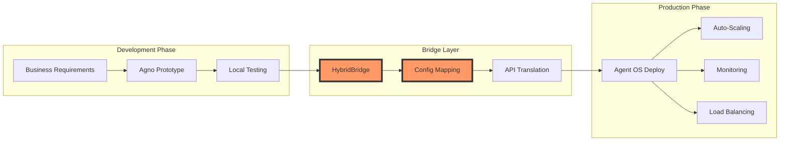
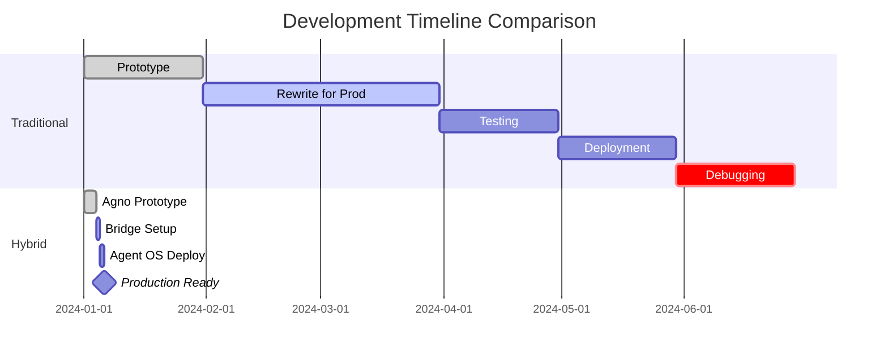
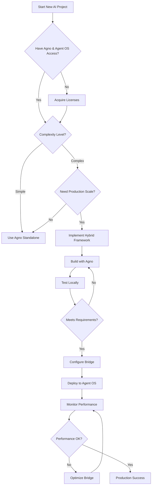

# The Hybrid Framework: Combining Agno + Agent OS for Next-Generation AI Development


[](https://opensource.org/licenses/MIT)
[](https://github.com/yourusername/hybrid-framework/stargazers)
[](http://makeapullrequest.com)

> ⚠️ **Important**: This framework requires access to two separate commercial platforms: [Agno](https://agno.com) and [Agent OS by Builder Methods](https://buildermethods.com/agent-os). See [Requirements](#requirements) for details.

## A Revolutionary Approach to Building Production-Ready AI Agent Systems

### Executive Summary

The convergence of rapid prototyping frameworks with production-grade orchestration platforms represents a paradigm shift in AI development. This document presents a hybrid methodology that leverages **Agno** for accelerated agent development and **Agent OS** (by Builder Methods) for enterprise-scale deployment, creating a seamless bridge from prototype to production in days rather than months.

**[Read Full Disclaimer](./DISCLAIMER.md)** | **[View Requirements](#requirements)** | **[Get Started](#getting-started)**

---

## 📋 Requirements

This framework demonstrates an architectural pattern that requires:

- **Agno SDK** - Commercial license from [Agno AGI](https://agno.com)
- **Agent OS Platform** - Access from [Builder Methods](https://buildermethods.com/agent-os)
- **Python 3.8+** - For running examples
- **API Keys** - For both platforms (see [.env.example](./.env.example))

> **Note**: The code examples in this repository are conceptual demonstrations. Actual implementation requires valid licenses and API access to both platforms.

---

## The Current Challenge in AI Development

Traditional AI development faces a fundamental dichotomy:
- **Prototyping Tools**: Fast but not production-ready
- **Enterprise Platforms**: Robust but slow to implement
- **The Gap**: Typically 3-6 months from working prototype to deployed solution

This hybrid framework demonstrates how to eliminate that gap by bridging two best-in-class tools.

---

## 🏗️ The Hybrid Architecture

### Core Philosophy
```
Prototype with Agno → Validate with Users → Deploy on Agent OS → Scale Infinitely
```

### Visual Overview: The Bridge Pattern



### Architectural Layers

```yaml
┌─────────────────────────────────────────┐
│         User Interface Layer            │
│    (Natural Language / Conversational)  │
├─────────────────────────────────────────┤
│    Agent OS Orchestration (Builder)     │
│   (Production Runtime & Monitoring)     │
├─────────────────────────────────────────┤
│        Agno Development Layer           │
│    (Rapid Prototyping & Testing)        │
├─────────────────────────────────────────┤
│       Core Agent Logic Library          │
│    (Domain-Specific Intelligence)       │
├─────────────────────────────────────────┤
│      External Systems Integration       │
│        (APIs, Databases, Tools)         │
└─────────────────────────────────────────┘
```

---

## ⏱️ Timeline Comparison

### Traditional vs Hybrid Approach



*Note: Timelines are estimates based on architectural efficiency. Actual results vary by use case and complexity.*

---

## 🚀 Phase-Based Implementation Strategy

### Phase 1: Rapid Prototype (48-72 Hours)
**Tool**: Agno  
**Focus**: Core agent logic and capability validation

```python
# Example: Agno prototype structure (requires Agno SDK)
from agno import Agent, Task, Tool  # Requires commercial license

class IntelligentAgent(Agent):
    def __init__(self):
        self.tools = [
            ParseTool(),      # Natural language understanding
            ProcessTool(),    # Core business logic
            GenerateTool()    # Output generation
        ]
    
    async def execute(self, input_data: str) -> dict:
        # Parse → Process → Generate workflow
        parsed = await self.parse(input_data)
        processed = await self.process(parsed)
        return await self.generate(processed)
```

### Phase 2: Production Hardening (Days 3-5)
**Tool**: Agent OS Integration Layer  
**Focus**: Reliability, monitoring, scalability

```yaml
# Agent OS deployment configuration (Builder Methods format)
agent_config:
  name: intelligent_agent_v1
  runtime: agent-os-2.0
  
  capabilities:
    - natural_language_processing
    - multi-step_reasoning
    - tool_orchestration
    
  monitoring:
    - latency_tracking
    - error_rates
    - success_metrics
    
  scaling:
    auto_scale: true
    min_instances: 2
    max_instances: 100
    target_latency: 2000ms
```

### Phase 3: Continuous Enhancement (Ongoing)
**Tool**: Hybrid Development Environment  
**Focus**: A/B testing, continuous learning, feature expansion

---

## 🔧 Key Innovation: The Bridge Pattern

### Decision Flow for Implementation



### Implementation Bridge (Conceptual)

```python
# Conceptual bridge implementation
# Actual implementation requires both SDKs
class HybridAgentBridge:
    def __init__(self, agno_agent, agent_os_config):
        """
        Connects Agno prototype to Agent OS production
        Requires valid API keys for both platforms
        """
        self.prototype = agno_agent  # Agno agent instance
        self.production = AgentOSWrapper(agent_os_config)  # Builder Methods wrapper
        
    async def execute(self, request):
        # Use Agno logic with Agent OS infrastructure
        result = await self.prototype.process(request)
        
        # Agent OS handles monitoring, scaling, reliability
        return await self.production.wrap_response(result)
```

---

## 📊 Performance Expectations

### Theoretical Benefits*

| Metric | Traditional Approach | Hybrid Framework | Improvement |
|--------|---------------------|------------------|-------------|
| Time to Production | 12-24 weeks | 1-2 weeks | 10-20x faster |
| Rewrite Required | Yes | No | 100% code reuse |
| Risk Level | High | Low | Incremental validation |
| Scaling Complexity | Manual | Automatic | Built-in from day 1 |

*Results vary based on use case complexity, team expertise, and specific requirements.

---

## ❓ Frequently Asked Questions

### Q: Do I need both Agno and Agent OS licenses?
**A:** Yes, these are separate commercial products. Agno is used for development, Agent OS (Builder Methods) for production deployment.

### Q: Can I use this framework with just one of the tools?
**A:** While you can use either tool independently, the hybrid approach's value comes from combining both. Using just one tool means following their standard workflows.

### Q: What if my Agno prototype uses features not supported by Agent OS?
**A:** The bridge pattern includes compatibility checking. You'll need to either modify your prototype or implement custom adapters for unsupported features.

### Q: Is this framework officially supported by Agno or Builder Methods?
**A:** No, this is an independent, community-driven project demonstrating an architectural pattern. For official support, contact the respective vendors.

### Q: What are the actual costs involved?
**A:** Costs vary based on usage and licensing tiers. Contact [Agno](https://agno.com) and [Builder Methods](https://buildermethods.com) for current pricing.

### Q: Can I contribute to this framework?
**A:** Yes! See our [Contributing Guide](CONTRIBUTING.md) for details. Note that contributions should focus on the bridge pattern and integration strategies, not the proprietary platforms themselves.

---

## 🔧 Troubleshooting

### Common Issues and Solutions

#### Bridge Connection Fails
```bash
Error: Cannot connect to Agent OS endpoint
```
**Solutions:**
- Verify `AGENT_OS_API_KEY` is set correctly in `.env`
- Check network connectivity to Agent OS cloud
- Ensure your Agent OS subscription is active
- Verify endpoint URL matches your region

#### Agno Import Errors
```bash
ImportError: No module named 'agno'
```
**Solutions:**
- Install Agno SDK: `pip install agno-sdk` (requires license)
- Verify Python environment has access to Agno
- Check `AGNO_API_KEY` is configured

#### Performance Degradation in Production
**Symptoms:** Increasing latency, failed requests  
**Solutions:**
- Check Agent OS scaling policies are active
- Monitor circuit breaker status in bridge
- Verify cache configuration
- Review Agent OS dashboard for resource limits

#### Configuration Mismatch
**Symptoms:** Features work in Agno but fail in Agent OS  
**Solutions:**
- Review compatibility matrix in bridge logs
- Check Agent OS capability configuration
- Ensure all required Agent OS modules are enabled

---

## 🚀 Getting Started

### Prerequisites

1. **Obtain Platform Access**
   - Sign up for [Agno](https://agno.com) developer account
   - Get [Agent OS](https://buildermethods.com/agent-os) platform access
   - Obtain API keys for both platforms

2. **Set Up Environment**
```bash
# Clone the repository
git clone https://github.com/yourusername/hybrid-framework
cd hybrid-framework

# Copy environment template
cp .env.example .env

# Edit .env with your API keys
nano .env  # or use your preferred editor

# Install dependencies
pip install -r requirements.txt
```

3. **Verify Installation**
```bash
# Run installation test
python test_installation.py

# If successful, run examples
python examples/agno-prototype.py
python examples/hybrid-bridge.py
```

### Resources

#### 📦 Source Code
- **Agno**: [GitHub Repository](https://github.com/agno-agi/agno) - Rapid agent prototyping framework
- **Agent OS**: [GitHub Repository](https://github.com/buildermethods/agent-os) - Production orchestration platform by Builder Methods

#### 📚 Documentation
- **Agno**: [Official Docs](https://docs.agno.com/introduction) - Getting started with Agno
- **Agent OS**: [Official Docs](https://buildermethods.com/agent-os) - Agent OS platform guide

#### 🎥 Video Tutorials
- **Agno**: [Framework Overview](https://youtu.be/nLkBNnnA8Ac?si=YHp2_h4HsCe2son9) - Introduction to rapid prototyping
- **Agent OS**: [Platform Walkthrough](https://youtu.be/4PlVnrliN3Q?si=QBOqacv0NVyBVRrX) - Production deployment guide

#### 🚀 Quick Links
- [Hybrid Framework Examples](./examples) - Working code samples (conceptual)
- [Environment Setup](./.env.example) - Required configuration
- [Disclaimer](./DISCLAIMER.md) - Important legal information
- [Contributing Guidelines](./CONTRIBUTING.md) - How to contribute

---

## 🤝 Contributing

We welcome contributions! Please see our [Contributing Guide](CONTRIBUTING.md) for details.

### How to Contribute
1. Fork the repository
2. Create your feature branch (`git checkout -b feature/AmazingFeature`)
3. Commit your changes (`git commit -m 'Add some AmazingFeature'`)
4. Push to the branch (`git push origin feature/AmazingFeature`)
5. Open a Pull Request

**Note:** Contributions should focus on the bridge pattern and integration strategies, not modifications to the proprietary platforms themselves.

---

## ⚖️ License & Disclaimer

This project is licensed under the MIT License - see the [LICENSE](LICENSE) file for details.

**Important:** This framework requires commercial licenses for both Agno and Agent OS. The framework itself is open source, but the platforms it connects are proprietary. See [DISCLAIMER.md](./DISCLAIMER.md) for full details.

---

## 🙏 Acknowledgments

- The Agno team at Agno AGI for revolutionary prototyping capabilities
- Builder Methods for the Agent OS production platform
- The AI development community for continuous innovation
- All contributors who make this framework better every day

---

**Version**: 1.0.0  
**Last Updated**: September 2025  
**Maintained by**: The Hybrid Framework Community

*This is an architectural pattern demonstrating how to bridge rapid prototyping with production deployment. Actual implementation requires access to both commercial platforms.*