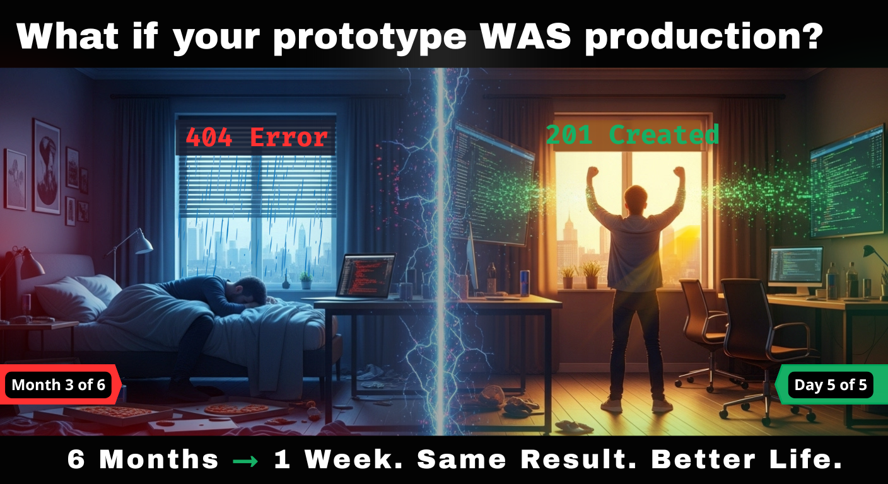
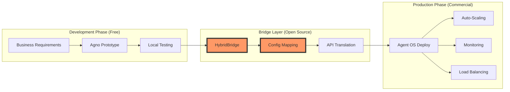
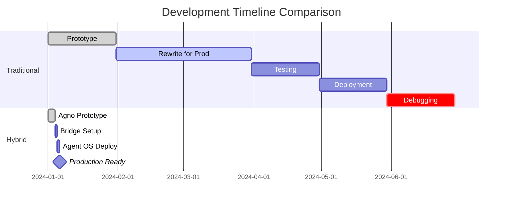
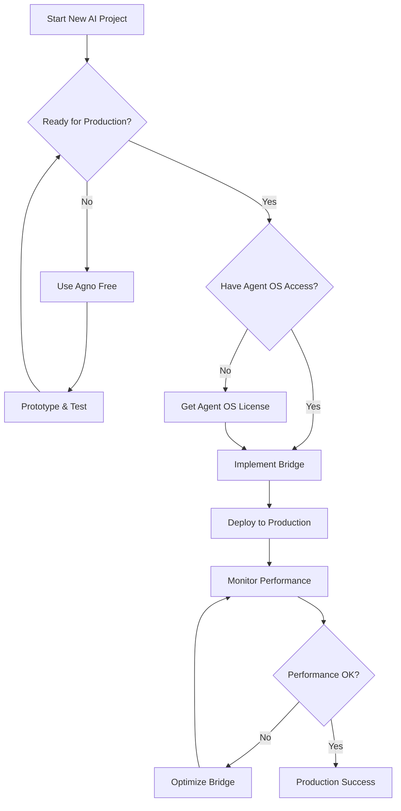

# The Hybrid Framework: Combining Agno + Agent OS for Next-Generation AI Development



[](https://opensource.org/licenses/MIT)
[](https://github.com/yourusername/hybrid-framework/stargazers)
[](http://makeapullrequest.com)

> ⚠️ **Important**: This framework combines two platforms: [Agno](https://github.com/agno-agi/agno) (open source, free) and [Agent OS by Builder Methods](https://buildermethods.com/agent-os) (commercial platform). See [Requirements](#requirements) for details.

## A Revolutionary Approach to Building Production-Ready AI Agent Systems

### Executive Summary

The convergence of rapid prototyping frameworks with production-grade orchestration platforms represents a paradigm shift in AI development. This document presents a hybrid methodology that leverages **Agno** (open source) for accelerated agent development and **Agent OS** by Builder Methods (commercial) for enterprise-scale deployment, creating a seamless bridge from prototype to production in days rather than months.

**[Read Full Disclaimer](./DISCLAIMER.md)** | **[View Requirements](#requirements)** | **[Get Started](#getting-started)**

---

## 🎯 **NEW DEVELOPERS: START HERE FIRST**

> **📚 [Agent OS Workflow Guide](docs/AGENT-OS-WORKFLOW-GUIDE.md)** - Your complete developer playbook
>
> This comprehensive guide is the **single source of truth** for AI-driven development. Whether you're new to Agent OS or returning to a project, this guide covers everything from quick start checklists to advanced troubleshooting.

---

## 📋 Requirements

This framework demonstrates an architectural pattern that combines:

- **Agno Framework** - Open source (Apache 2.0 license) - FREE to use from [Agno AGI](https://github.com/agno-agi/agno)
- **Agent OS Platform** - Commercial platform from [Builder Methods](https://buildermethods.com/agent-os) - requires paid access
- **Python 3.8+** - For running examples
- **API Keys** - Only needed for Agent OS (see [.env.example](./.env.example))

> **Note**: You can start prototyping immediately with the free, open-source Agno framework. Agent OS is only required when you're ready to deploy to production.

---

## The Current Challenge in AI Development

Traditional AI development faces a fundamental dichotomy:
- **Prototyping Tools**: Fast but not production-ready
- **Enterprise Platforms**: Robust but slow to implement
- **The Gap**: Typically 3-6 months from working prototype to deployed solution

This hybrid framework demonstrates how to eliminate that gap by bridging a free open-source prototyping tool with a commercial production platform.

---

## 🏗️ The Hybrid Architecture

### Core Philosophy
```
Prototype with Agno (Free) → Validate with Users → Deploy on Agent OS (Paid) → Scale Infinitely
```

### Visual Overview: The Bridge Pattern



### Architectural Layers

```yaml
┌─────────────────────────────────────────┐
│         User Interface Layer            │
│    (Natural Language / Conversational)  │
├─────────────────────────────────────────┤
│    Agent OS Orchestration (Builder)     │
│   (Production Runtime & Monitoring)     │
│         [Commercial Platform]           │
├─────────────────────────────────────────┤
│        Agno Development Layer           │
│    (Rapid Prototyping & Testing)        │
│         [Open Source - Free]            │
├─────────────────────────────────────────┤
│       Core Agent Logic Library          │
│    (Domain-Specific Intelligence)       │
├─────────────────────────────────────────┤
│      External Systems Integration       │
│        (APIs, Databases, Tools)         │
└─────────────────────────────────────────┘
```

---

## ⏱️ Timeline Comparison

### Traditional vs Hybrid Approach



*Note: Timelines are estimates based on architectural efficiency. Actual results vary by use case and complexity.*

---

## 🚀 Phase-Based Implementation Strategy

### Phase 1: Rapid Prototype (48-72 Hours) - FREE
**Tool**: Agno (Open Source)
**Cost**: $0
**Focus**: Core agent logic and capability validation

```python
# Example: Agno prototype structure (open source, no license required)
from agno import Agent, Task, Tool  # Free, open source

class IntelligentAgent(Agent):
    def __init__(self):
        self.tools = [
            ParseTool(),      # Natural language understanding
            ProcessTool(),    # Core business logic
            GenerateTool()    # Output generation
        ]

    async def execute(self, input_data: str) -> dict:
        # Parse → Process → Generate workflow
        parsed = await self.parse(input_data)
        processed = await self.process(parsed)
        return await self.generate(processed)
```

### Phase 2: Production Hardening (Days 3-5) - PAID
**Tool**: Agent OS Integration Layer
**Cost**: Based on Agent OS pricing
**Focus**: Reliability, monitoring, scalability

```yaml
# Agent OS deployment configuration (Builder Methods format)
agent_config:
  name: intelligent_agent_v1
  runtime: agent-os-2.0

  capabilities:
    - natural_language_processing
    - multi-step_reasoning
    - tool_orchestration

  monitoring:
    - latency_tracking
    - error_rates
    - success_metrics

  scaling:
    auto_scale: true
    min_instances: 2
    max_instances: 100
    target_latency: 2000ms
```

### Phase 3: Continuous Enhancement (Ongoing)
**Tool**: Hybrid Development Environment
**Focus**: A/B testing, continuous learning, feature expansion

---

## 🔧 Key Innovation: The Bridge Pattern

### Decision Flow for Implementation



### Implementation Bridge (Conceptual)

```python
# Conceptual bridge implementation
# Agno is free/open source, Agent OS requires commercial access
class HybridAgentBridge:
    def __init__(self, agno_agent, agent_os_config):
        """
        Connects free Agno prototype to commercial Agent OS production
        Only requires Agent OS API key for production deployment
        """
        self.prototype = agno_agent  # Free Agno agent instance
        self.production = AgentOSWrapper(agent_os_config)  # Builder Methods wrapper

    async def execute(self, request):
        # Use Agno logic with Agent OS infrastructure
        result = await self.prototype.process(request)

        # Agent OS handles monitoring, scaling, reliability
        return await self.production.wrap_response(result)
```

---

## 📊 Performance & Cost Analysis

### Framework Costs

| Component | Traditional Approach | Hybrid Framework |
|-----------|---------------------|------------------|
| Prototyping Tool | Various (often paid) | Agno (FREE) |
| Development Time | 12-24 weeks @ $150k+ | 1-2 weeks @ $5-10k |
| Production Platform | Custom build or expensive | Agent OS (commercial) |
| Rewrite Required | Yes (expensive) | No (bridge pattern) |
| Total Initial Cost | $200k-500k | $5-10k + Agent OS subscription |

*Agent OS pricing varies based on usage. Contact Builder Methods for current rates.*

---

## ❓ Frequently Asked Questions

### Q: Is Agno really free?
**A:** Yes! Agno is open source under the Apache 2.0 license. You can use it for any purpose, including commercial projects, without paying anything.

### Q: What do I need to pay for?
**A:** Only Agent OS (by Builder Methods) requires a commercial subscription for production deployment. You can prototype entirely for free with Agno.

### Q: Can I use this framework with just Agno?
**A:** Yes, you can use Agno standalone for development and testing. The bridge pattern and Agent OS are only needed when you want production-grade scaling, monitoring, and reliability.

### Q: Is this framework officially supported by Agno or Builder Methods?
**A:** No, this is an independent, community-driven project demonstrating an architectural pattern. For official support, contact the respective projects.

### Q: Can I use other production platforms instead of Agent OS?
**A:** The bridge pattern is conceptually portable. While our implementation focuses on Agent OS, the pattern could be adapted for other production platforms.

### Q: What's the minimum cost to try this?
**A:** $0. You can start with the free, open-source Agno framework and only pay for Agent OS when you're ready for production.

---

## 🔧 Troubleshooting

### Common Issues and Solutions

#### Agno Installation Issues
```bash
# Agno is installed directly from GitHub (free)
pip install git+https://github.com/agno-agi/agno.git
```
**No API key needed** - It's open source!

#### Agent OS Connection Fails
```bash
Error: Cannot connect to Agent OS endpoint
```
**Solutions:**
- Verify `AGENT_OS_API_KEY` is set correctly in `.env`
- Check your Agent OS subscription is active
- Verify endpoint URL matches your region

#### Bridge Pattern Issues
**Symptoms:** Features work in Agno but fail in Agent OS
**Solutions:**
- Review compatibility in bridge logs
- Check Agent OS capability configuration
- Ensure required Agent OS modules are enabled

---

## 📖 **THE DEVELOPER'S BIBLE: Agent OS Workflow Guide**

> **🎯 START HERE FIRST** - This is your single source of truth for AI-driven development

**[📚 Agent OS Workflow Guide](docs/AGENT-OS-WORKFLOW-GUIDE.md)** - The complete developer playbook that covers:

- **Quick Start Checklist** - Get back into any project instantly
- **Workflow Decision Matrix** - Know exactly what to do in every situation
- **Context Prompts for Every Situation** - Perfect prompts for any development task
- **Keeping AI Agents on Track** - Framework enforcement strategies
- **Troubleshooting & Recovery** - Solutions for every common problem
- **Best Practices & Anti-Patterns** - Learn from experience

**This guide is essential for developers at ANY stage** - whether you're:
- 🆕 **New to Agent OS** - Complete onboarding and setup
- 🔄 **Returning to a project** - Quick context restoration
- 🚀 **Building features** - Step-by-step implementation
- 🐛 **Debugging issues** - Systematic problem solving
- 📈 **Scaling to production** - Enterprise deployment strategies

---

## 🚀 Getting Started

### Prerequisites

1. **Install Agno (Free)**
```bash
# Install directly from GitHub
pip install git+https://github.com/agno-agi/agno.git
```

2. **Get Agent OS Access (When Ready for Production)**
   - Sign up at [Builder Methods](https://buildermethods.com/agent-os)
   - Obtain API key for production deployment
   - Configure in `.env` file

3. **Set Up Environment**
```bash
# Clone the repository
git clone https://github.com/yourusername/hybrid-framework
cd hybrid-framework

# Copy environment template
cp .env.example .env

# Edit .env with your Agent OS API key (if you have one)
# You can start without it using just Agno!
nano .env

# Install dependencies
pip install -r requirements.txt
```

4. **Start Prototyping (Free)**
```bash
# Run Agno examples without any API keys
python examples/agno-prototype.py
```

5. **📖 Read the Workflow Guide**
```bash
# Open the complete developer playbook
open docs/AGENT-OS-WORKFLOW-GUIDE.md
```

### Resources

#### 📚 **Essential Documentation**
- **🎯 [Agent OS Workflow Guide](docs/AGENT-OS-WORKFLOW-GUIDE.md)** - **START HERE** - Complete developer playbook
- **📋 [Changelog](CHANGELOG.md)** - Track all enhancements and improvements
- **🤝 [Contributing Guidelines](CONTRIBUTING.md)** - How to contribute to the project
- **⚠️ [Disclaimer](DISCLAIMER.md)** - Important licensing and platform information

#### 📦 Source Code
- **Agno**: [GitHub Repository](https://github.com/agno-agi/agno) - Free, open-source agent framework (Apache 2.0)
- **Agent OS**: [GitHub Repository](https://github.com/buildermethods/agent-os) - Commercial production platform by Builder Methods

#### 📖 Platform Documentation
- **Agno**: [Official Docs](https://docs.agno.com/introduction) - Getting started with free Agno framework
- **Agent OS**: [Official Docs](https://buildermethods.com/agent-os) - Agent OS platform guide (commercial)

#### 🎥 Video Tutorials
- **Agno**: [Framework Overview](https://youtu.be/nLkBNnnA8Ac?si=YHp2_h4HsCe2son9) - Introduction to open-source prototyping
- **Agent OS**: [Platform Walkthrough](https://youtu.be/4PlVnrliN3Q?si=QBOqacv0NVyBVRrX) - Production deployment guide

#### 🚀 Quick Links
- [Hybrid Framework Examples](./examples) - Working code samples
- [Environment Setup](./.env.example) - Configuration template
- [Docker Setup](./docker-compose.yml) - Local development environment

---

## 🤝 Contributing

We welcome contributions! Please see our [Contributing Guide](CONTRIBUTING.md) for details.

### How to Contribute
1. Fork the repository
2. Create your feature branch (`git checkout -b feature/AmazingFeature`)
3. Commit your changes (`git commit -m 'Add some AmazingFeature'`)
4. Push to the branch (`git push origin feature/AmazingFeature`)
5. Open a Pull Request

**Note:** Contributions should focus on the bridge pattern and integration strategies, not modifications to Agno (open source) or Agent OS (proprietary) themselves.

---

## ⚖️ License & Disclaimer

This project is licensed under the MIT License - see the [LICENSE](LICENSE) file for details.

**Important:**
- The Hybrid Framework pattern itself is open source (MIT)
- Agno is open source (Apache 2.0) - FREE to use
- Agent OS requires a commercial license from Builder Methods
- See [DISCLAIMER.md](./DISCLAIMER.md) for full details

---

## 🙏 Acknowledgments

- The Agno team at Agno AGI for their open-source rapid prototyping framework
- Builder Methods for the Agent OS production platform
- The AI development community for continuous innovation
- All contributors who make this framework better every day

---

**Version**: 1.0.0
**Last Updated**: September 2025
**Maintained by**: The Hybrid Framework Community

*Start prototyping for free with Agno. Scale to production with Agent OS when you're ready.*