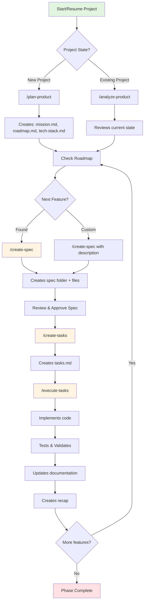

# 🚀 AGENT OS WORKFLOW GUIDE
**The Complete Developer Playbook for AI-Driven Development**

> **Purpose**: This is your single source of truth for working with Agent OS. Start here, always.  
> **Location**: Save as `AGENT_OS_WORKFLOW_GUIDE.md` in your project root  
> **Version**: 1.1.0 | Updated: September 2025 - Added AI Agent Management Section

---

## 📚 Table of Contents

1. [Quick Start Checklist](#quick-start-checklist)
2. [Workflow Decision Matrix](#workflow-decision-matrix)
3. [The Agent OS Development Cycle](#the-agent-os-development-cycle)
4. [Context Prompts for Every Situation](#context-prompts-for-every-situation)
5. [Command Reference](#command-reference)
6. [Keeping AI Agents on Track](#keeping-ai-agents-on-track)
7. [Common Workflows](#common-workflows)
8. [Project State Assessment](#project-state-assessment)
9. [Troubleshooting Guide](#troubleshooting-guide)
10. [Best Practices & Anti-Patterns](#best-practices--anti-patterns)
11. [Emergency Recovery](#emergency-recovery)

---

## 🎯 Quick Start Checklist

**Returning to the project? Start here:**

```bash
□ 1. Open your IDE (Claude Code, Cursor, etc.)
□ 2. Navigate to project: cd /path/to/your/project
□ 3. Check project state: ls -la .agent-os/specs/
□ 4. Review last recap: cat .agent-os/recaps/[latest].md
□ 5. Check roadmap status: grep "\[ \]" .agent-os/product/roadmap.md
□ 6. Start AI agent with appropriate context prompt (see below)
□ 7. Continue where you left off
```

---

## 🔄 Workflow Decision Matrix

### "I want to..." → "You should..."

| **Your Goal** | **Agent OS Command** | **When to Use** |
|---------------|---------------------|-----------------|
| Start a brand new project | `/plan-product` | First time setup, no .agent-os folder exists |
| See what to work on next | `/analyze-product` or check roadmap | Returning to project, unsure of status |
| Build a new feature | `/create-spec` | Ready to implement next roadmap item |
| Break down a feature | `/create-tasks` | Spec is approved, need implementation steps |
| Start coding | `/execute-tasks` | Tasks are created, ready to build |
| Continue existing work | `/execute-tasks [task-number]` | Resuming partially complete tasks |
| Review what was built | Check `.agent-os/recaps/` | After any major completion |
| Fix or modify existing feature | Create amendment in spec folder | Need to change completed work |
| Add unplanned feature | `/create-spec` with description | New requirement not in roadmap |

---

## 🔁 The Agent OS Development Cycle



---

## 💬 Context Prompts for Every Situation

### 1️⃣ **Starting Fresh (New Session, Continuing Work)**

```markdown
## Agent OS Context - Continue Development

We're working on [PROJECT_NAME] following the Agent OS framework. This is a new session continuing existing work.

**Current Status:**
- Check `.agent-os/recaps/` for last completed work
- Active spec: `.agent-os/specs/[LATEST_FOLDER]/`
- Review tasks.md for completion status

**Framework Rules:**
- Follow instructions in `.agent-os/instructions/`
- Apply standards from `.agent-os/standards/`
- Reference product context in `.agent-os/product/`

**Next Action:**
Please check the current task status and suggest next steps.
Use `/execute-tasks` to continue incomplete tasks or `/create-spec` for new features.

**Working Directory:** `[YOUR_PROJECT_PATH]`
```

### 2️⃣ **Starting New Feature (Spec Creation)**

```markdown
## Agent OS Context - New Feature Development

We're creating a new feature spec for [PROJECT_NAME].

**Roadmap Context:**
The next planned feature from our roadmap is: [FEATURE_NAME]
(Or describe your custom feature if not from roadmap)

**Instructions:**
1. Run `/create-spec` to begin
2. Follow the spec creation process
3. Ensure alignment with mission and tech-stack
4. Create comprehensive user stories

**Standards to Apply:**
- Tech stack from `.agent-os/product/tech-stack.md`
- Best practices from `.agent-os/standards/`

Ready to create the spec. Type `/create-spec` to begin.
```

### 3️⃣ **Implementation Mode (Executing Tasks)**

```markdown
## Agent OS Context - Task Execution

We're implementing tasks for [SPEC_NAME] in [PROJECT_NAME].

**Current Spec:** `.agent-os/specs/[SPEC_FOLDER]/`
**Task Status:** Check tasks.md for ☑️ completed vs ☐ pending

**Execution Rules:**
1. Follow TDD - write tests first
2. Implement incrementally
3. Validate each subtask
4. Update task checkboxes as completed
5. Create recap when finished

**Command:** `/execute-tasks [task-number]` or just `/execute-tasks` for next pending

Ready to implement. Which task should we execute?
```

### 4️⃣ **Review & Planning Mode**

```markdown
## Agent OS Context - Project Review

Let's review the current state of [PROJECT_NAME] and plan next steps.

**Review Checklist:**
1. Check roadmap progress: `.agent-os/product/roadmap.md`
2. Review completed specs: `.agent-os/specs/*/`
3. Read recent recaps: `.agent-os/recaps/`
4. Identify incomplete tasks

**Planning Actions:**
- Use `/analyze-product` for comprehensive review
- Identify next priority from roadmap
- Check for blocked or incomplete work

Please analyze current state and recommend next actions.
```

---

## 📋 Command Reference

### Core Commands

| Command | Purpose | Creates | Example |
|---------|---------|---------|---------|
| `/plan-product` | Initialize new project | mission.md, roadmap.md, tech-stack.md | `/plan-product "AI-powered CRM"` |
| `/analyze-product` | Review existing project | Analysis summary | `/analyze-product` |
| `/create-spec` | Define new feature | Spec folder with spec.md, sub-specs/ | `/create-spec "User authentication"` |
| `/create-tasks` | Break down spec | tasks.md with checklist | `/create-tasks` |
| `/execute-tasks` | Implement code | Actual code + tests | `/execute-tasks 1` |

### Command Flow Rules

```
NEVER: /execute-tasks before /create-tasks
NEVER: /create-tasks before /create-spec
NEVER: Skip /create-spec and just start coding
ALWAYS: Complete full cycle for each feature
ALWAYS: Create recap after major completions
```

---

## 🤖 Keeping AI Agents on Track

### The Challenge

AI agents like Claude Code are powerful but can drift from the Agent OS framework if not properly guided. They may:
- Skip the `/create-spec` step and jump to coding
- Mix tasks from different features in one spec
- Create files in wrong locations
- Forget to follow the complete workflow cycle

### Prevention Strategies

#### 1. **Start Every Session with Framework Enforcement**

```markdown
## AGENT OS FRAMEWORK ENFORCEMENT

You MUST follow the Agent OS workflow exactly:
1. NEVER implement without a spec folder
2. ALWAYS use dated folders: YYYY-MM-DD-feature-name
3. ONE feature = ONE spec folder
4. Follow the cycle: /create-spec → /create-tasks → /execute-tasks

**Current Working Directory:** [YOUR_PROJECT_PATH]
**Check existing specs:** .agent-os/specs/

What feature are we working on today?
```

#### 2. **Spec Folder Structure Reminder**

When starting any new feature, explicitly state:

```markdown
Before we begin coding, we need to create the proper spec structure:

1. Run: /create-spec "[feature description]"
2. This will create: .agent-os/specs/YYYY-MM-DD-feature-name/
3. Review the generated spec.md
4. Run: /create-tasks
5. Only then run: /execute-tasks

Do NOT add tasks to existing unrelated spec folders.
```

#### 3. **Phase Boundary Enforcement**

```markdown
## Phase Transition Rules

We are transitioning from Phase [X] to Phase [Y].

RULES:
- Phase 1 specs stay in Phase 1 folders
- Phase 2 features get NEW spec folders
- Never mix phase work in the same spec
- Reference planning docs but create proper specs

Example:
- ❌ WRONG: Adding Phase 2 tasks to Phase 1 spec folder
- ✅ RIGHT: Creating new 2025-09-14-transaction-orchestrator/
```

### Common AI Agent Mistakes & Corrections

| **Mistake** | **Symptom** | **Correction** | **Prevention Prompt** |
|-------------|-------------|----------------|----------------------|
| Skipping spec creation | No spec folder for feature | Create spec retrospectively | "First, run /create-spec for this feature" |
| Mixing features | Multiple unrelated tasks in one spec | Split into separate specs | "One feature per spec folder only" |
| Wrong folder format | Missing date prefix or wrong structure | Rename/recreate properly | "Use YYYY-MM-DD-feature-name format" |
| Implementing without tasks | No tasks.md file | Create tasks before coding | "Run /create-tasks before implementation" |
| No recaps | Missing completion documentation | Create recap after implementation | "Create recap in .agent-os/recaps/" |

### Validation Checklist for AI Agents

After any AI agent work session, verify:

```bash
□ Spec folder exists with correct date format
□ spec.md contains proper user stories
□ spec-lite.md has condensed version
□ tasks.md has numbered checklist
□ Code implementation matches tasks
□ Tasks are marked complete
□ Recap created if feature done
□ No mixed phase work
```

### Corrective Prompts When Agent Goes Off-Track

#### If Agent Starts Coding Without Spec:

```markdown
STOP. We need to follow Agent OS workflow.

1. What feature are you implementing?
2. Create proper spec first: /create-spec "[feature]"
3. Then create tasks: /create-tasks
4. Only then implement: /execute-tasks

Do not continue coding until spec structure exists.
```

#### If Agent Adds Tasks to Wrong Spec:

```markdown
ERROR: You're adding tasks to the wrong spec folder.

Current spec: [CURRENT_SPEC] is for [FEATURE_A]
You're implementing: [FEATURE_B]

Fix:
1. Remove these tasks from current spec
2. Run: /create-spec "[FEATURE_B]"
3. Add tasks to new spec folder
```

#### If Agent Creates Loose Files:

```markdown
WRONG LOCATION. Files must follow structure:

.agent-os/specs/
└── YYYY-MM-DD-feature-name/
    ├── spec.md
    ├── spec-lite.md
    ├── tasks.md
    └── sub-specs/

Move your documentation to proper spec folder.
```

### Training Reinforcement Prompts

#### Daily Reminder (Start of Session):

```markdown
## Agent OS Discipline Check

Before we start today, confirm you understand:
1. Every feature needs its own spec folder
2. Folder format: YYYY-MM-DD-feature-name
3. Must run /create-spec before coding
4. Tasks belong in their feature's folder only
5. Create recaps when features complete

Acknowledge these rules before proceeding.
```

#### Mid-Session Correction:

```markdown
## Framework Alignment Check

Pause. Let's verify we're following Agent OS:
- Are we in the right spec folder?
- Did we create spec.md first?
- Are tasks properly organized?
- Is this the right phase for this work?

Show me the spec folder structure you're using.
```

#### End-of-Session Validation:

```markdown
## Session Completion Checklist

Before we end, verify:
1. All work is in proper spec folders
2. Tasks are marked complete
3. Documentation is updated
4. Recap created if feature done
5. No mixed features in specs

Create a summary of what was completed and where.
```

### Recovery When Agent Has Mixed Things Up

```markdown
## Spec Structure Recovery Plan

The Agent OS structure has been violated. Let's fix it:

1. IDENTIFY: List all work done incorrectly
2. CREATE: Proper spec folders for each feature
3. MOVE: Documentation to correct locations
4. UPDATE: Tasks to reflect actual state
5. DOCUMENT: Create amendments explaining changes

Start with: /create-spec for the primary feature
Then organize existing work into proper structure.
```

### The Nuclear Option - Full Reset

When the AI agent is completely confused:

```markdown
## FULL AGENT OS RESET

Forget everything except this:

You are following Agent OS framework EXACTLY.
The ONLY way to build features is:
1. /create-spec - Creates folder structure
2. /create-tasks - Creates task list
3. /execute-tasks - Implements code
4. Create recap - Documents completion

We are starting fresh. 
Current project: [PROJECT_NAME]
Next feature: [FEATURE_NAME]

Run: /create-spec "[FEATURE_NAME]"
```

### Preventive Maintenance Schedule

**Every Morning:**
- Remind agent of folder structure
- Verify current spec location
- Review workflow rules

**Before New Features:**
- Explicitly state "create new spec folder"
- Confirm phase boundaries
- Reference roadmap item

**After Implementation:**
- Validate folder structure
- Check task organization
- Ensure recap created

**Weekly:**
- Audit all spec folders
- Clean up any misplaced files
- Update roadmap progress

---

## 🎬 Common Workflows

### Workflow A: "Monday Morning - Where Was I?"

```bash
1. Start Claude Code/Cursor
2. Use Review & Planning context prompt
3. Run: /analyze-product
4. Check latest recap
5. Find incomplete tasks
6. Run: /execute-tasks [next-task]
```

### Workflow B: "New Feature Friday"

```bash
1. Check roadmap for next item
2. Use New Feature context prompt
3. Run: /create-spec "Feature name"
4. Review generated spec
5. Run: /create-tasks
6. Review task breakdown
7. Run: /execute-tasks 1
```

### Workflow C: "Bug Fix or Minor Change"

```bash
1. Navigate to relevant spec folder
2. Create: amendments/YYYY-MM-DD-fix-description.md
3. Document the change needed
4. Use Implementation context prompt
5. Make targeted fixes
6. Update tasks.md if needed
```

### Workflow D: "Client Changed Requirements"

```bash
1. Find original spec folder
2. Create amendment document
3. Update spec.md with changes
4. Revise tasks.md
5. Run: /execute-tasks [affected-task]
```

---

## 🔍 Project State Assessment

### Quick Status Check Script

```bash
#!/bin/bash
# Save as: check-status.sh

echo "=== Agent OS Project Status ==="
echo ""
echo "📁 Recent Specs:"
ls -lt .agent-os/specs/ | head -5
echo ""
echo "✅ Completed Tasks:"
grep -r "\[x\]" .agent-os/specs/*/tasks.md | wc -l
echo ""
echo "⏳ Pending Tasks:"
grep -r "\[ \]" .agent-os/specs/*/tasks.md | wc -l
echo ""
echo "📊 Last Recap:"
ls -lt .agent-os/recaps/*.md | head -1
echo ""
echo "🎯 Next Roadmap Items:"
grep -A 2 "\[ \]" .agent-os/product/roadmap.md | head -10
```

### Understanding Spec Structure

```
.agent-os/specs/
├── 2025-09-13-feature-name/    ✅ Correct format
│   ├── spec.md                 # Main specification
│   ├── spec-lite.md            # Condensed version
│   ├── tasks.md                # Implementation checklist
│   ├── sub-specs/              # Technical details
│   │   ├── technical-spec.md
│   │   ├── database-schema.md
│   │   └── api-spec.md
│   └── amendments/             # Changes/updates
│
└── loose-file.md               ❌ Wrong - avoid this!
```

---

## 🔧 Troubleshooting Guide

### Problem: "I don't know what to work on"

**Solution:**
```bash
1. Check roadmap: cat .agent-os/product/roadmap.md | grep "\[ \]"
2. Or run: /analyze-product
3. Or ask: "What's next?" (triggers roadmap check)
```

### Problem: "Spec exists but no tasks"

**Solution:**
```bash
1. Navigate to spec folder
2. Run: /create-tasks
3. Review generated tasks.md
4. Proceed with: /execute-tasks
```

### Problem: "Tasks exist but not executing"

**Solution:**
```bash
1. Check you're in correct spec folder
2. Use Implementation context prompt
3. Run: /execute-tasks 1 (or specific task number)
4. Ensure AI agent has full context
```

### Problem: "Lost track of what's been built"

**Solution:**
```bash
1. Read recaps: ls -la .agent-os/recaps/
2. Check completed tasks: grep "\[x\]" .agent-os/specs/*/tasks.md
3. Run: /analyze-product for full review
```

### Problem: "Commands not working"

**Solution:**
```bash
1. Ensure you're using Claude Code or tool with Agent OS support
2. Check .claude/commands/ or .cursorrules exists
3. Verify commands are properly prefixed with /
4. Try full path: Execute the instructions in .agent-os/instructions/core/[command].md
```

---

## ✅ Best Practices & Anti-Patterns

### ✅ DO THIS

1. **One Spec at a Time**: Complete full cycle before starting next
2. **Follow the Flow**: spec → tasks → execute → recap
3. **Test First**: TDD approach for all implementations
4. **Document Decisions**: Use amendments for changes
5. **Regular Recaps**: After each major feature
6. **Check Roadmap**: Stay aligned with product vision
7. **Small Specs**: 3-5 day implementations, not month-long epics

### ❌ DON'T DO THIS

1. **Skip Specs**: Never jump straight to coding
2. **Bulk Specs**: Don't create all specs upfront
3. **Ignore Tasks**: Don't freestyle implement
4. **Forget Recaps**: Always document what was built
5. **Break Structure**: Keep spec folder format consistent
6. **Mix Phases**: Complete Phase 1 before Phase 2
7. **Hoard Context**: Give AI full project context

---

## 🆘 Emergency Recovery

### "Everything is broken, how do I recover?"

```bash
# 1. Backup current state
cp -r .agent-os .agent-os.backup

# 2. Find last working state
git log --oneline -10
git status

# 3. Review last known good spec
ls -lt .agent-os/specs/

# 4. Start fresh session with full context
# Use this emergency prompt:
```

```markdown
## EMERGENCY RECOVERY CONTEXT

Project [PROJECT_NAME] needs recovery assessment.

**Required Actions:**
1. Run /analyze-product for full state analysis
2. Check all incomplete specs and tasks
3. Verify codebase matches documented specs
4. Identify any orphaned or broken features
5. Create recovery plan

**Do Not:**
- Delete any existing specs
- Start new features
- Make major changes

Please perform comprehensive analysis and suggest recovery steps.
```

---

## 📈 Productivity Tips

### Daily Routine

```
Morning:
1. Check status (5 min)
2. Review roadmap (2 min)
3. Load context prompt (1 min)
4. Execute tasks (4-6 hours)
5. Create recap (10 min)

Evening:
1. Update task checkboxes
2. Commit changes
3. Note tomorrow's starting point
```

### Weekly Planning

```
Monday: Review roadmap, plan week's features
Tuesday-Thursday: Execute implementation
Friday: Complete features, create recaps, plan next week
```

### Context Management

- Keep specs small (3-5 day scope)
- Use spec-lite.md for AI context efficiency
- Reference previous recaps for continuity
- Don't overload AI with unnecessary history

---

## 🎯 The Golden Rules

1. **Trust the Process**: Agent OS works when you follow it
2. **Stay in Flow**: Complete cycles, don't jump around
3. **Document Everything**: Specs, tasks, recaps
4. **Test Obsessively**: TDD is not optional
5. **Ship Incrementally**: Small, complete features
6. **Review Regularly**: Weekly roadmap check
7. **Keep Context Fresh**: New session = context prompt

---

## 📝 Quick Reference Card

```
Start New Project:     /plan-product
Continue Project:      /analyze-product
New Feature:          /create-spec → /create-tasks → /execute-tasks
Next Task:            /execute-tasks
Check Status:         ls .agent-os/specs/ && ls .agent-os/recaps/
Get Unstuck:          /analyze-product
```

---

## 🔗 Related Documentation

- `.agent-os/instructions/` - Command implementations
- `.agent-os/standards/` - Coding standards
- `.agent-os/product/` - Product vision
- `.agent-os/specs/` - Feature specifications
- `.agent-os/recaps/` - Completion summaries

---

**Remember**: Agent OS is your co-pilot, not autopilot. Guide it with clear commands, and it will build with precision.

*When in doubt, check the roadmap and run `/analyze-product`.*

---

**Last Updated**: September 2025  
**Maintainer**: Your Team  
**Questions**: Check `.agent-os/instructions/` or re-run `/plan-product`